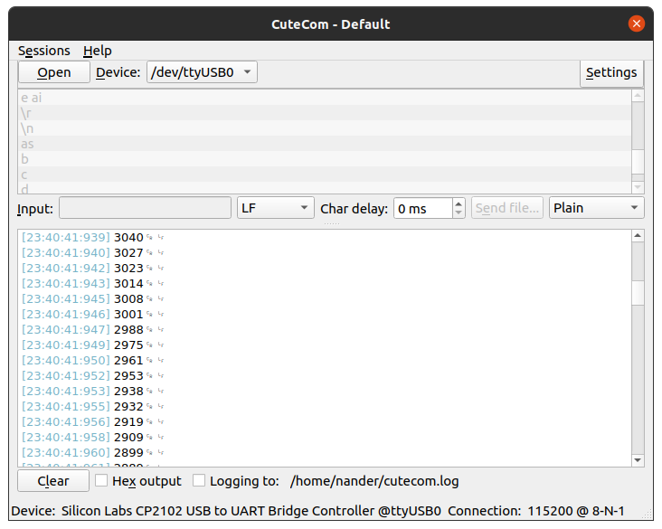

# My-STM32-ADC-AN
This project is a simple example demonstrating the behavior of the ADC peripheral of the STM32 NUCLEO-G474RE kit, as described in the Application Note available in the 'doc' directory of this repository.

## The Application Note  

All the behavior of the project is described (in Portuguese) in the document [AN_G474RE_ADC_Application_Note.pdf](https://github.com/NanderSantos/My-STM32-ADC-AN/blob/main/doc/AN_G474RE_ADC_Application_Note.pdf). However, in a simplified way, the ADC was configured to collect voltage values ​​from a potentiometer in continuous conversion operation mode, for a single channel and using DMA, and transmit these values ​​through the serial to a PC in order to visualize the values collected.

## Example

### Includes

```c
#include <stdio.h>
#include <string.h>
```

Inclusion of the libraries necessary to perform the manipulation of strings and the data stream.

### Defines

```c
#define ADC_BUFFER_SIZE 4096
```
Sets the size of the buffer to store the ADC readings

### Variables

```c
uint16_t adcBuffer[ADC_BUFFER_SIZE];
uint16_t adcDataCount = 0;
char message[10];
```
- Buffer responsible for storing the values ​​read by the ADC
- 
- Variable responsible for storing the buffer position of the new data read by the ADC

- String for sending data to the computer via UART

### Callback

```c
void HAL_ADC_ConvCpltCallback(ADC_HandleTypeDef * hadc) {

	adcDataCount = (adcDataCount == (ADC_BUFFER_SIZE - 1)) ? (adcDataCount + 1) : 0;
	sprintf(message, "%hu\r\n", adcBuffer[adcDataCount]);
	HAL_UART_Transmit(&huart1, (uint8_t *) message, strlen(message), HAL_MAX_DELAY);
}
```

This ADC interrupt callback is called whenever a conversion is completed by the ADC and the EOC signal is triggered. It is responsible for identifying the position of the buffer in which the new data was stored by the DMA and for transmitting that data through the UART

### Results

An example of the data received on the computer via the serial can be seen in the image below. The data shown was captured when the potentiometer value was in transition.

<p align="center">
  
</p>
